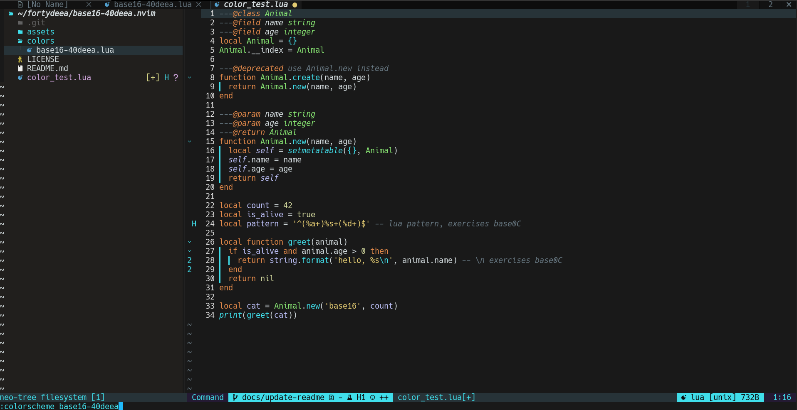
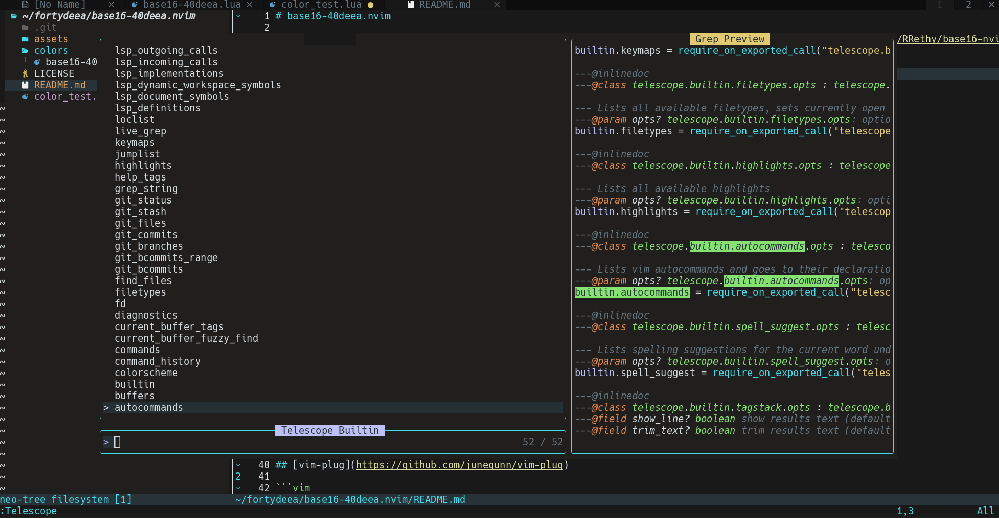

# base16-40deea.nvim

A dark theme with #40DEEA as the main color. This theme is made with [RRethy/base16-nvim](https://github.com/RRethy/base16-nvim).




# Installation

Install with your preferred package manager.

## [lazy.nvim](https://github.com/folke/lazy.nvim)

```lua
{
  'fortydeea/base16-40deea.nvim',
  dependencies = { 'RRethy/base16-nvim' },
  lazy = false,
  priority = 1000
}
```
## [vim.pack](https://neovim.io/doc/user/pack.html)

```lua
vim.pack.add {
  'https://github.com/RRethy/base16-nvim',
  'https://github.com/fortydeea/base16-40deea.nvim',
}
```

## [packer.nvim](https://github.com/wbthomason/packer.nvim)

```lua
use {
  'fortydeea/base16-40deea.nvim',
  requires = { 'RRethy/base16-nvim' },
}
```

## [vim-plug](https://github.com/junegunn/vim-plug)

```vim
Plug 'RRethy/base16-nvim'
Plug 'fortydeea/base16-40deea.nvim'
```
